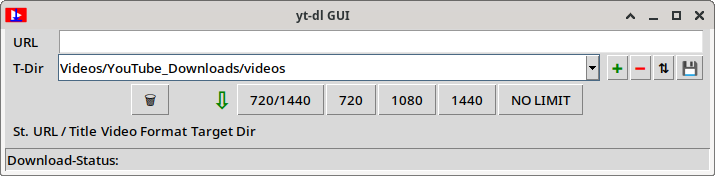
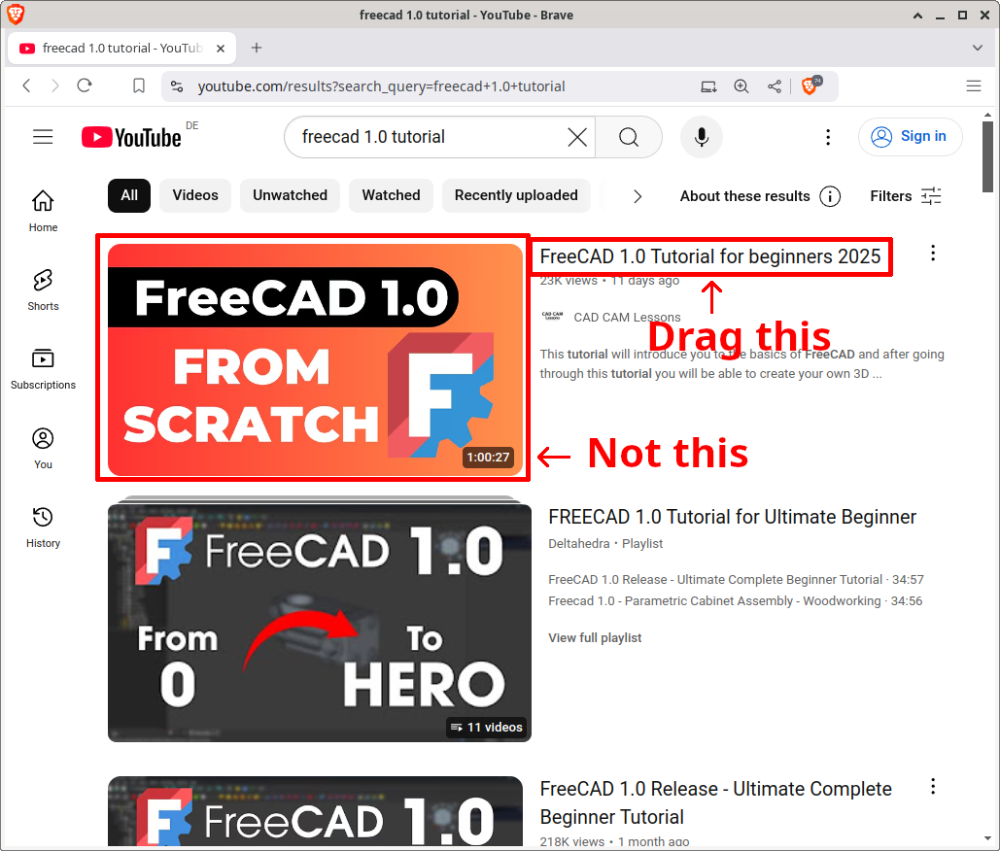
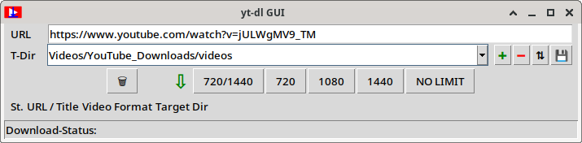
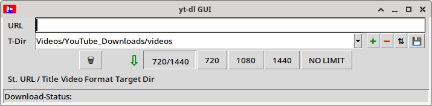
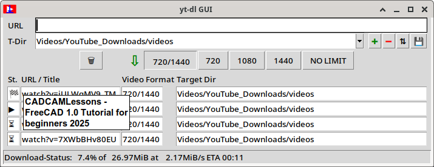

# yt_dlp_gui
A simple GUI for [yt-dlp](https://github.com/yt-dlp/yt-dlp)

Download single videos from YouTube in a more convenient way. Uses yt-dlp under the hood.
Other video platforms than YouTube are currently not supported.

# Features
* Drag & Drop videos from the browser directly into the URL entry field.
* Avoid duplicate downloads.
* A (configurable) set of video formats.
* A (configurable) set of target directories/folders.  
  Configured but non-existing target directories will be created when a download starts.
* A queue of added videos, including their status.
* An overview of the overall progress.
* A status bar for the progress of the current download.
* Tooltips in the table containing the queue with some extra information.
* A minimal pause between downloads to avoid the "Too Many Requests" error from YouTube.
* Some minimal postprocessing, mostly just renaming files.  

# Intended use / audience
* Users should be comfortable with yt-dlp's command line arguments, as they are reflected in this tool's configuration file.
* The idea is to use the browser for searching in YouTube and then download videos from that search result using this tool.
* Playlists are not supported.

Currently, there are no plans to do add playlist support or to add a "settings" dialog that spares users from understanding the yt-dlp parameters. :-)    
However, if you're a developer and really want these features, feel free to fork and send me a pull request after you've implemented them. 

This tool has been developed and tested on Linux, other operating systems could need some minor adaptations for handling absolute/relative file names and line endings.

# Installation
* Copy these files to a directory (not necessarily a new one):
  * yt_dl_gui.py
  * tooltip.py
  * copy or rename yt_dl_gui_SAMPLE.json to yt_dl_gui.json  
    and adapt the latter one to your needs.
* Create a subdirectory named "icons" within it and copy this file to there:
  * yt_dl_gui.png

## Dependencies
* python 3
* yt-dlp installed in an [importable](https://docs.python.org/3/reference/import.html) way  
* tkinterdnd2
* ffmpeg
* A unicode font that supports the status emojis, e.g. noto-fonts-emoji and noto-fonts-extra

## Configuration
All configuration is done in the file yt_dl_gui.json.
You can add/change values, but you should not change the file structure (changing the order within one section is OK though).

Some sections probably need some extra explanation:

### The main section
* "target_dirs"  
  Values for the select box in the GUI. Can be changed within the GUI. Just always have at least one entry.  
  All entries that don't start with a / are relative to the directory from where you started this tool. 
* "temp_dir"  
  Is where yt-dlp writes downloaded files before they are converted into the selected output format.
* "download_archive"  
  Is optional. If given, a list of all downloaded videos is created per target directory. This makes it easier to avoid duplicate downloads.

### The section "video_formats"
It has entries consisting of pairs. The first value is the label for the button that will be created, the second one is the format specification that will be passed to yt-dlp.  
The first entry is somewhat special: It auto-selects one of two given formats based on the video's aspect ratio (portrait/landscape).  
The other ones are self-explanatory (I think).

### The section "yt_dl_params"
Everything from this section will be passed to yt-dlp (almost) unchanged.
Just a few things are added, such as the user-selected video format from the selection configured in the aforementioned section, the value of "temp_dir" and "download_archive" and, of course, the vireo's URL.
Most entries directly correspond to the command line arguments, so won't be explained here.
If you want to change any of these, please consult the documentation of yt-dlp. 

#### The sub-section "outtmpl"
* "default"
  Is the template for the file names of the downloaded files.
* "chapter"
  Is the template for the chapter titles.

#### Mapping command-line arguments to the needed parameters in the configuration file:
See [getting_parameters.md](getting_parameters.md) 

### The section "postprocessing"
These settings are applied after every download.
* "underscores_to_spaces"
  Useful if you want to remove emojis etc. from filenames but want to keep spaces.  
  In this case, set "yt_dl_params" -> "restrictfilenames" and this one both to true
* "remove_at_sign"  
  Even with "restrictfilenames" set to true, some file names still contain @ signs (so far, I encountered only one). This option removes the first one.
* "add_newlines_to_description"  
  This is the only postprocessing feature that actually changes a file. The .description files are provided by YouTube have no newline at the end of the file.
  This option adds two of them, so if you do `cat *.description`, you get a clear output with even an empty line between them. 
* "rename_description" / "rename_description_suffix"
  Use this if you prefer different file names like `.txt` or even `.nfo`.
* "delete_empty_description"
  No need to keep empty files, right? :-)
* "add_tumb"
  Renames the thumnail files from e.g. `.jpg` to `_thumb.jpg`
* "subtitles_dots_to_underscores"
  Also a personal preference of me ... I'd like the subtitle files to ben named e.g. `_en.vtt` instead of `.en.vtt`

# Usage

Start the program from a directory that is the parent of all of your target directories.
In many cases, it makes sense to use your home directory, as it is probably the parent of "Videos".  
After starting, you are in

## "No preselected format" operation mode

You will get something like this:  
  
All buttons except the ones for the video formats have tooltips.

Now, you can copy/paste a video's URL into the URL entry field **or drag and drop it directly from the browser**.
Brave seems to work more reliably than Firefox. No idea why. You can drag from a search result list or from a channel's video list.
Dragging the video title also seems to be more reliable than dragging the thumbnail.
Again, no idea why. But often, both work.  

Then you get this:  
  

As soon as you select a video format by clicking the button, the video gets queued and the URL field is cleared.  
**The video will not be queued if it's video ID is already entered in the download_archive file (see Configuration) or any file containing the ID in it's filename exists in the selected target dir.**

## "Preselected format" operation mode
While the URL field is empty, you can select a format that will automatically be applied to everything that is pasted / dropped from that moment on.
This is useful if you want to queue a lot of videos without clicking a format button every time:  
  
These buttons work a bit like radio buttons, but because they can also work as normal buttons, I did not use the "real" radio buttons.
Also, the selection can be cleared. 

## In both modes ...

While the queue is processed, it looks something like this:  
  
The first one is finished, the second one is running, the other ones are waiting.

When a download is finished or aborted due to an error, the program tries to determine the title of the video from anything existing in the file system, then adds a tooltip to the table.
So in case of an error, you can check which video was the unsuccessful one.
Unfortunately, this only works if at least something could be downloaded.
E.g. the description is mostly downloaded before the video.

The buttons right to the "T-Dir" dropdown can be used to add/remove/sort target dirs.
When only one is left, "-" does nothing.
The "save" button saves the complete configuration including the target directories.
Without using it, changes are lost. 

# Developing

Feel free to fork this project and add features.
I'd appreciate if you send me pull requests, so I can add them here.
If you need to do adaptations for another OS, I'd appreciate a cooperation in order to have one version that fits them all.  
However, sometimes I'm short in time, so my responses could be a bit slow.

# Final comments
This tool was created because a) I needed it and b) to learn python.
Probably, several things could have been done in a better / more elegant way.
Feel free to send me some suggestions for improvement, but be nice to the python noob that I am. :-)  
I'm using type hints because according to the "Zen of Python", "explicit is better than implicit".
But maybe I forgot to add them here and there ... :-)
